# 5000

## Summary

5000 is a simple dice game.

This repository implements an engine as a Go library for this game and runs some simulations with various strategies as an attempt to find an optimal one (WIP).

## Rules

> There are a lot of variations for this game's rules. I sticked to the following ones:

A player rolls five dices and counts its points:
- any `1` marks 100 points
- any `5` marks 50 points
- three-of-a-kinds mark 100 times their rank (for instance `3,3,3` marks 300 and `5,5,5` marks 500) except `1,1,1` which marks 1000.
- the first player to reach 5000 points wins the game.

If a round does not mark any points, the turns stops right there and the player ends with 0 points.

Else, it can choose to stop right there and confirm its score for this turn or to roll some dices again, starting a new round to try to increase its score.

It has to exclude at least one counter before starting the next round though. This means if it starts with `n` dices, it will roll at maximum `n - 1` dices the next one.

There's one exception to this last rule: if the player achieves to have all dices to mark in one round, it can choose to get all 5 dices back in its hand and start again with all of them.

## Testing

I implemeted some property based tests to try this pattern out.

## Probabilitites

With `n` dices there are `6^n` possible outcomes:
- `n=5: 7776`
- `n=4: 1296`
- `n=3: 216`
- `n=2: 36`
- `n=1: 6`

Let `X_n` be the random variable giving the score for a draw with `n` dices (for `n >= 1` and `n <= 5`).

It's easy to get the probability distribution for `X_1`:
- `P(X_1 = 0) = 4 / 6`
- `P(X_1 = 50) = 1 / 6`
- `P(X_1 = 100) = 1 / 6`

> In the following, `?` means 2,3,4 or 6.

or even for `X_2`:
- `P(X_2 = 0) = 16 / 36` (?,? so `4^2` possibilities)
- `P(X_2 = 50) = 8 / 36` (?,5 or 5,?)
- `P(X_2 = 100) = 9 / 36` (?,1 or 1,? or 5,5)
- `P(X_1 = 150) = 2 / 36` (1,5 or 5,1)
- `P(X_1 = 200) = 1 / 36` (1,1)

It starts to get harder for `X_3` as one needs to take into accounts the three-of-a-kinds:
- `P(X_3 = 0) = 60 / 216` (`4^3` possibilities minus the chance of getting three-of-a-kinds that are not 1,1,1 or 5,5,5)
- `P(X_3 = 50) = 48 / 216` (5,?,? or ?,5,? or ?,?,5)
- `P(X_3 = 100) = 60 / 216` (1,?,? or ?,1,? or ?,?,1 or 5,5,? or ?,5,5 or 5,?,5)
- `P(X_3 = 150) = 24 / 216` (1,5,? or 5,1,? or ?,1,5 or ?,5,1 or 1,?,5 or 5,?,1)
- `P(X_3 = 200) = 16 / 216` (2,2,2 or 1,1,? or 1,?,1 or ?,1,1 or 1,5,5 or 5,1,5 or 5,5,1)
- `P(X_3 = 250) = 3 / 216` (1,1,5 or 5,1,1 or 1,5,1)
- `P(X_3 = 300) = 1 / 216` (3,3,3)
- `P(X_3 = 400) = 1 / 216` (4,4,4)
- `P(X_3 = 500) = 1 / 216` (5,5,5)
- `P(X_3 = 600) = 1 / 216` (6,6,6)
- `P(X_3 = 1000) = 1 / 216` (1,1,1)

I cheated a bit and got the `X_4` and `X_5` distributions generated by an algorithm (see [./pkg/distribution/scores.go](./pkg/distribution/scores.go)).

Here are all five distributions when plotted on a graph:
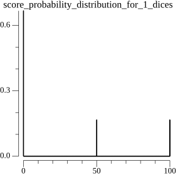
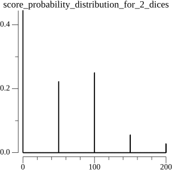
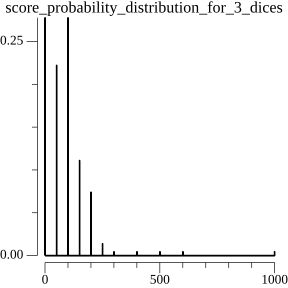
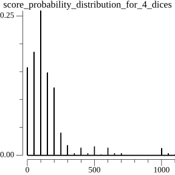
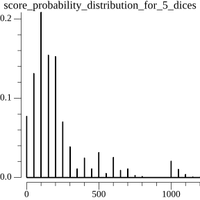

## Strategies

### Roll non markers dices again as long as there are enough of them

My first strategy idea was fairly simple: the AI rolls all non markers dices again if it has enough of them in hand. The "enough" is quantified with a threshold parameter which indicates the level of risk the AI is ready to accept. It's obvious following the previous section anlysis that the less dices one has at its disposal, the more chance it has to draw a garbage.

A treshold of 6 means the AI will never roll dices again.

I computed the outcome of 10_000 games for such AIs with all possible thresholds (1, 2, 3, 4, 5 and 6):
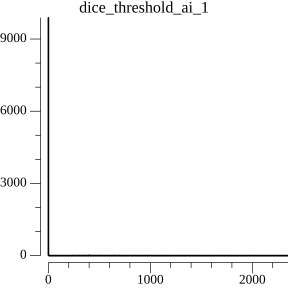
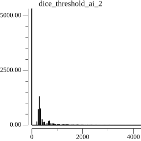
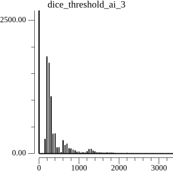
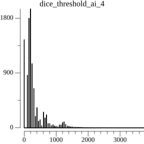
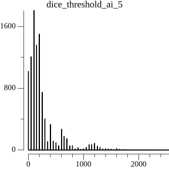
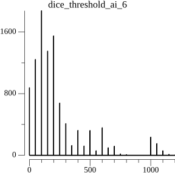

I computed each AI's expectation value to rank them:
* threshold = 1: 7.000
* threshold = 2: 230.500
* threshold = 3: 298.505
* threshold = 4: 290.045
* threshold = 5: 250.140
* threshold = 6: 233.420

The 1-threshold AI almost always fails, it's indeed risking a (4/6) probability of failure every round!

The 6-threshold AI simply reproduces the score distribution of the `X_5` score random variable. This makes sense since it always keeps its first round's results and never roll dices again. It has the less number of lost turns (score 0) but it's less efficient than other rolling strategies.

The most efficient strategy seems to be the one rolling dices again as long as it has three of them at disposal. It increases the chance of getting three-of-a-kinds without risking too much with smaller hands which seems to be a reasonable trade-off.

Now the question is: can we do better, for instance by rolling again some markers and not simply keeping all of them?

### Roll non markers dices again along some markers as long as there are enough of them

For instance if I draw 5,5 or 1,5 should I roll one 5 again ((1/6) chance of improving my score)?

TODO
